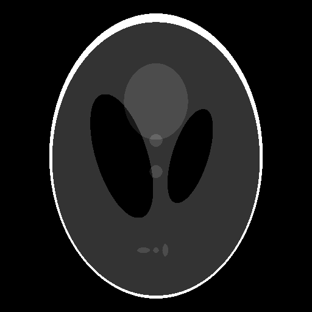

# Image Processing Benchmark

ImageProcessingBenchmark is a repository for benchmarking image processing projects written in various programming languages like julia, python and matlab etc.

Currently, The benchmark compares performance differences in JuliaImages projects with Skimage and its submodules.

# Image morphology 
Morphological image processing is a collection of non-linear operations related to the shape or morphology of features in an image.

According to Wikipedia, morphological operations rely only on the relative ordering of pixel values, 
not on their numerical values, and therefore are especially suited to the processing of binary images.

Morphological operations can also be applied to greyscale images such that their light 
transfer functions are unknown and therefore their absolute pixel values are of no or minor interest.

Dilate ↴ 
 
Dilation adds pixels on the object boundaries.

| Operations       | Original | Julia         | Python  |
|:----------------:|:--------:|:-------------:|:-------:|
| dilate|  |  |  |
| Time Taken(in seconds)|   This is the original image used for benchmark     | 0.0010208595811142      |   0.06084681900028954 |
        

 

Erode ↴ 
 
Erosion removes pixels on object boundaries.

| Operations       | Original | Julia         | Python  |
|:----------------:|:--------:|:-------------:|:-------:|
| erode|  |  |  |
| Time Taken(in seconds)|   This is the original image used for benchmark     | 0.0010233712737166      |   0.04374955000093905 |
        

 

Opening ↴ 
 
The opening operation erodes an image and then dilates the eroded image, using the same structuring element for both operations.

| Operations       | Original | Julia         | Python  |
|:----------------:|:--------:|:-------------:|:-------:|
| opening|  |  |  |
| Time Taken(in seconds)|   This is the original image used for benchmark     | 0.0021581063675324      |   0.08658933300102944 |
        

 

Closing ↴ 
 
The closing operation dilates an image and then erodes the dilated image, using the same structuring element for both operations.

| Operations       | Original | Julia         | Python  |
|:----------------:|:--------:|:-------------:|:-------:|
| closing|  |  |  |
| Time Taken(in seconds)|   This is the original image used for benchmark     | 0.0020868577832636      |   0.08676055099931546 |
        

 

Tophat ↴ 
 
The tophat of an image is defined as the image minus its morphological opening. This operation returns the bright spots of the image that are smaller than the structuring element.

| Operations       | Original | Julia         | Python  |
|:----------------:|:--------:|:-------------:|:-------:|
| tophat|  |  |  |
| Time Taken(in seconds)|   This is the original image used for benchmark     | 0.0019937310555111      |   0.09380965799937258 |
        

 

Bothat ↴ 
 
The black_tophat of an image is defined as its morphological closing minus the original image. This operation returns the dark spots of the image that are smaller than the structuring element.

| Operations       | Original | Julia         | Python  |
|:----------------:|:--------:|:-------------:|:-------:|
| bothat|  |  |  |
| Time Taken(in seconds)|   This is the original image used for benchmark     | 0.0020297383562423      |   0.086672956998882 |
        

 

